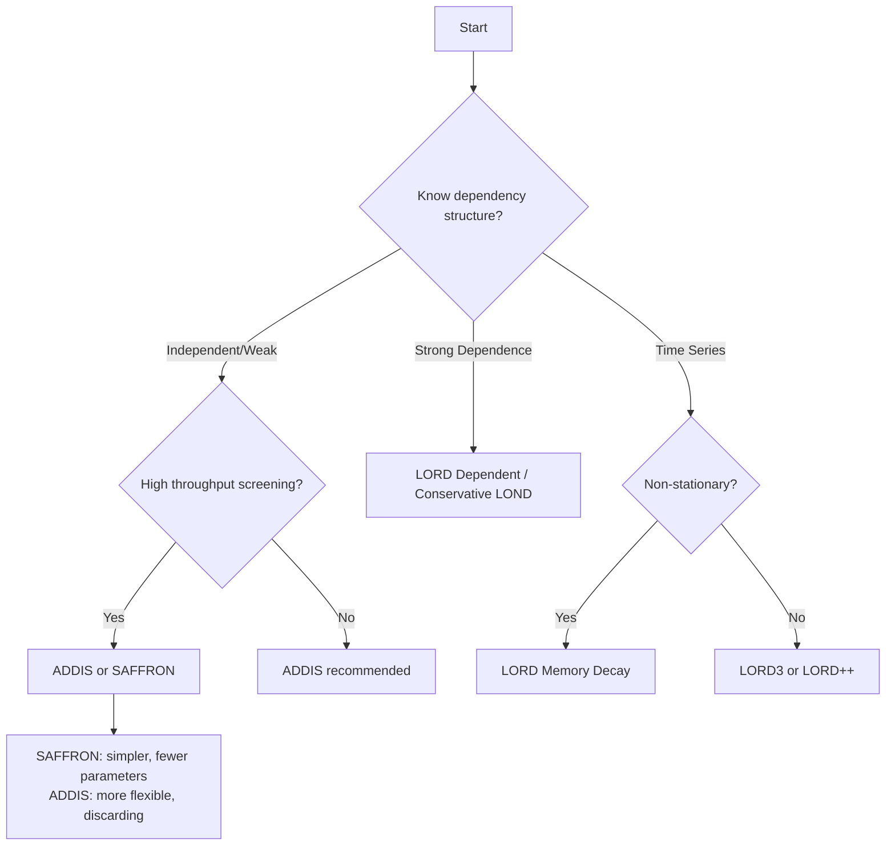

# Investing Methods

Alpha investing methods form the core of modern online FDR control. These methods maintain a "wealth" that increases with discoveries and is spent on testing, allowing adaptive thresholds that respond to the success of previous tests.

## Overview

The key insight of alpha investing is to treat significance testing as an investment game:

1. **Start with initial wealth** $W_0$ 
2. **Spend wealth** to "buy" significance thresholds $\alpha_i$
3. **Earn wealth** from successful discoveries
4. **Adapt thresholds** based on current wealth

This framework allows methods to be more aggressive when discoveries are being made and more conservative when they are not.

## Available Methods

### Core Alpha Investing Methods

| **Method** | **Full Name** | **Key Feature** | **Best For** |
|------------|---------------|------------------|---------------|
| **[GAI](gai.md)** | Generalized Alpha Investing | Simple wealth dynamics | Educational/baseline |
| **Weighted GAI++** | Weighted Generalized Alpha Investing | Prior/penalty weights + memory decay | Streams with fixed side information |
| **[SAFFRON](saffron.md)** | Serial estimate of False Discovery proportiON | Candidate selection | High-throughput screening |
| **[ADDIS](addis.md)** | ADaptive DIScard | Discarding + candidate selection | General purpose (recommended) |

### LORD Family Methods

| **Method** | **Full Name** | **Key Feature** | **Best For** |
|------------|---------------|------------------|---------------|
| **[LORD3](lord.md)** | Levels based on Recent ObservatiOns | Recent discovery weighting | Time series analysis |
| **[LORD++](lord.md)** | LORD Plus Plus | Enhanced reward structure | Moderate dependence |
| **[LORD Dependent](lord.md)** | Dependent LORD | Handles arbitrary dependence | Strong dependence |
| **[LORD Discard](lord.md)** | LORD with Discarding | Large p-value discarding | Sparse alternatives |
| **[LORD Memory Decay](lord.md)** | Memory Decay LORD | Temporal decay weighting | Non-stationary time series |

### LOND Family Methods

| **Method** | **Full Name** | **Key Feature** | **Best For** |
|------------|---------------|------------------|---------------|
| **[LOND](lond.md)** | Levels based On Number of Discoveries | Simple discovery counting | Independent/weak dependence |

## Common Interface

All investing methods inherit from `AbstractSequentialTest` and implement:

```python
class InvestingMethod(AbstractSequentialTest):
    def __init__(self, alpha: float, wealth: float, **kwargs):
        """
        Parameters
        ----------
        alpha : float
            Target FDR level (0 < alpha < 1)
        wealth : float  
            Initial wealth (0 < wealth < alpha)
        **kwargs : dict
            Method-specific parameters
        """
        
    def test_one(self, p_value: float) -> bool:
        """
        Test a single p-value against current threshold.
        
        Parameters
        ----------
        p_value : float
            P-value to test (0 <= p_value <= 1)
            
        Returns
        -------
        bool
            True if null hypothesis is rejected, False otherwise
        """
        
    @property
    def alpha(self) -> Optional[float]:
        """Current significance threshold (None if no wealth)."""
```

## Parameter Selection Guide

### Universal Parameters

!!! tip "Alpha (alpha)"
    **Target FDR level**  
    - Standard values: 0.05, 0.1, 0.2
    - Choose based on tolerance for false discoveries
    - Higher values mean more discoveries but more false positives

!!! tip "Initial Wealth (W)"
    **Starting investment budget**  
    - Conservative: `/4`
    - Moderate: `/2` 
    - Aggressive: `3/4`
    - Constraint: Must satisfy `0 < W < alpha`

### Method-Specific Parameters

=== "ADDIS"
    ```python
    Addis(
        alpha=0.05,        # Target FDR
        wealth=0.025,      # Initial wealth (alpha/2)
        lambda_=0.25,      # Candidate threshold  
        tau=0.5           # Discarding threshold
    )
    ```
    
    - **Lambda (`lambda_`)**: Lower values mean more candidates, with a higher bar for rejection
    - **Tau (`tau`)**: Higher values mean fewer discarded tests

=== "SAFFRON"
    ```python
    Saffron(
        alpha=0.05,        # Target FDR
        wealth=0.025,      # Initial wealth
        lambda_=0.5        # Candidate threshold
    )
    ```
    
    - **Lambda (`lambda_`)**: Balance between candidate selection and rejection threshold

=== "LORD3"
    ```python
    LordThree(
        alpha=0.05,        # Target FDR  
        wealth=0.025,      # Initial wealth
        reward=0.025       # Wealth gained per discovery
    )
    ```
    
    - **reward**: Higher values mean more aggressive behavior after discoveries

## Performance Comparison

Based on simulation studies across various scenarios:

### Power (Higher is Better)

```
Scenario: pi0 = 0.9, effect size = 2.5

Method          Independent    Weak Depend.   Strong Depend.
ADDIS           0.82          0.78           0.71
SAFFRON         0.79          0.75           0.68  
LORD3           0.75          0.79           0.69
GAI             0.71          0.68           0.63
LOND            0.77          0.73           0.65
```

### FDR Control (Should be <= alpha)

```
Target alpha = 0.1

Method          Independent    Weak Depend.   Strong Depend.
ADDIS           0.089         0.094          0.097
SAFFRON         0.087         0.092          0.095
LORD3           0.091         0.096          0.098  
GAI             0.085         0.089          0.091
LOND            0.088         0.093          0.099
```

## Choosing the Right Method

### Decision Tree



### Practical Recommendations

=== "First Time User"
    **Start with ADDIS** using default parameters:
    ```python
    from online_fdr.investing.addis.addis import Addis
    addis = Addis(alpha=0.05, wealth=0.025, lambda_=0.25, tau=0.5)
    ```

=== "High-Throughput Screening"  
    **Use SAFFRON** for simplicity:
    ```python
    from online_fdr.investing.saffron.saffron import Saffron
    saffron = Saffron(alpha=0.1, wealth=0.05, lambda_=0.5)
    ```

=== "Time Series Data"
    **Use LORD3** for temporal patterns:
    ```python
    from online_fdr.investing.lord.three import LordThree  
    lord3 = LordThree(alpha=0.05, wealth=0.025, reward=0.025)
    ```

=== "Strong Dependence"
    **Use dependent methods**:
    ```python
    from online_fdr.investing.lond.lond import Lond
    lond = Lond(alpha=0.05, dependent=True)
    ```

## Advanced Usage Patterns

### Adaptive Parameter Tuning

```python
from online_fdr.investing.addis.addis import Addis

def adaptive_addis(p_values, target_discoveries=10):
    """Adaptively tune ADDIS parameters based on early performance."""
    
    # Start conservative
    method = Addis(alpha=0.05, wealth=0.025, lambda_=0.25, tau=0.5)
    
    discoveries = 0
    results = []
    
    for i, p_value in enumerate(p_values):
        decision = method.test_one(p_value)
        results.append(decision)
        
        if decision:
            discoveries += 1
            
        # Adapt after first 20 tests
        if i == 19 and discoveries < 2:
            # Too conservative, create more aggressive method
            method = Addis(alpha=0.1, wealth=0.05, lambda_=0.5, tau=0.6)
            
    return results
```

### Wealth Monitoring

```python
from online_fdr.investing.lord.three import LordThree

def monitor_wealth(method, p_values):
    """Monitor wealth dynamics during testing."""
    
    wealth_history = [method.wealth]
    
    for p_value in p_values:
        decision = method.test_one(p_value)
        wealth_history.append(getattr(method, 'wealth', 0))
        
        if len(wealth_history) > 1:
            wealth_change = wealth_history[-1] - wealth_history[-2]
            print(f"p={p_value:.3f}, decision={decision}, "
                  f"wealth={wealth_history[-1]:.3f} ({wealth_change:+.3f})")
    
    return wealth_history
```

### Early Stopping

```python
def early_stopping_fdr(method, p_value_generator, max_tests=1000, 
                      fdr_threshold=0.15):
    """Stop testing if empirical FDR exceeds threshold."""
    
    true_pos = false_pos = 0
    
    for i in range(max_tests):
        p_value, is_alternative = p_value_generator.sample_one()
        decision = method.test_one(p_value)
        
        if decision:
            if is_alternative:
                true_pos += 1
            else:
                false_pos += 1
                
            # Check FDR after sufficient discoveries
            if true_pos + false_pos >= 10:
                empirical_fdr = false_pos / (true_pos + false_pos)
                if empirical_fdr > fdr_threshold:
                    print(f"Early stopping at test {i+1}: FDR = {empirical_fdr:.3f}")
                    break
    
    return true_pos, false_pos
```

## Troubleshooting

### Common Issues

!!! warning "Wealth Becomes Zero"
    **Symptom**: Method stops making any rejections  
    **Cause**: Initial wealth too low or no early discoveries  
    **Solution**: Increase initial wealth or use more aggressive parameters

!!! warning "Too Many Rejections Early"
    **Symptom**: Many rejections in first few tests, then very few  
    **Cause**: Initial wealth too high  
    **Solution**: Decrease initial wealth or increase candidate thresholds

!!! warning "Poor Power"
    **Symptom**: Very few discoveries despite true alternatives  
    **Cause**: Overly conservative parameters  
    **Solution**: Increase wealth, decrease candidate thresholds, or choose different method

### Parameter Sensitivity

Methods ranked by parameter sensitivity (most to least sensitive):

1. **ADDIS**: Sensitive to lambda and tau selection
2. **SAFFRON**: Moderately sensitive to lambda
3. **LORD3**: Sensitive to reward parameter
4. **GAI**: Least sensitive, fewer parameters
5. **LOND**: Robust to parameter choices

## References and Further Reading

Each method page contains detailed references to the original papers. Key foundational papers:

- **Alpha Investing**: Foster & Stine (2008), "Alpha-investing: a procedure for sequential control of expected false discovery proportion"
- **SAFFRON**: Ramdas et al. (2017), "A sequential algorithm for false discovery rate control on directed acyclic graphs"  
- **ADDIS**: Tian & Ramdas (2019), "ADDIS: an adaptive discarding algorithm for online FDR control with conservative nulls"
- **LORD**: Javanmard & Montanari (2018), "Online Rules for Control of False Discovery Rate and False Discovery Exceedance"

## Next Steps

- **Explore individual method pages** for detailed documentation
- **See [Examples](../../examples/index.md)** for real-world applications  
- **Read [Theory](../../theory/index.md)** for mathematical foundations
- **Try [Quick Start](../../quickstart.md)** for hands-on introduction
