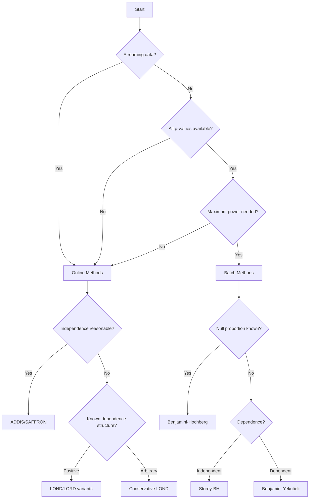

# Concepts

Understanding the fundamental concepts behind online FDR control is crucial for choosing the right methods and interpreting results correctly. This section covers the key theoretical foundations and practical considerations.

## Multiple Testing Problem

### The Challenge

When testing multiple hypotheses simultaneously, the probability of making at least one false discovery increases rapidly:

$$P(\text{at least one false positive}) = 1 - (1-\alpha)^m$$

For $m$ independent tests at level $\alpha = 0.05$:
- 1 test: 5% chance of false positive
- 10 tests: 40% chance  
- 100 tests: 99.4% chance

This inflation of Type I error necessitates **multiple testing corrections**.

### Error Rate Definitions

!!! info "Family-Wise Error Rate (FWER)"
    The probability of making **at least one** false discovery:
    $$\text{FWER} = P(\text{number of false positives} \geq 1)$$

!!! info "False Discovery Rate (FDR)"
    The **expected proportion** of false discoveries among all discoveries:
    $$\text{FDR} = E\left[\frac{\text{number of false positives}}{\max(\text{number of discoveries}, 1)}\right]$$

### When to Use Each

| **Metric** | **Best For** | **Trade-off** |
|------------|--------------|---------------|
| **FWER** | Safety-critical applications (medical devices, drug approval) | Very conservative, low power |
| **FDR** | Exploratory research (genomics, screening studies) | More powerful, allows some false positives |

## Online vs Batch Testing

### Batch Testing Paradigm

**Traditional approach**: Collect all p-values first, then apply correction

```python
# Batch approach
p_values = [0.01, 0.03, 0.08, 0.005, 0.12]  # All collected first
rejections = benjamini_hochberg(p_values, alpha=0.05)
```

**Characteristics:**
-  Optimal power for given FDR level
-  Simple to understand and implement
-  Requires waiting for all tests
-  No early stopping possible

### Online Testing Paradigm

**Modern approach**: Make decisions immediately as each p-value arrives

```python
# Online approach  
method = Addis(alpha=0.05, wealth=0.025, lambda_=0.25, tau=0.5)
for p_value in p_value_stream:  # Process one at a time
    decision = method.test_one(p_value)  # Immediate decision
    if decision:
        print(f"Significant result: p = {p_value}")
```

**Characteristics:**
-  Immediate decisions possible
-  Can stop early if needed
-  Suitable for streaming data
-  May have slightly lower power
-  More complex parameter tuning

### When to Choose Each

=== "Choose Online When"
    - Hypotheses arrive sequentially over time
    - Early stopping is valuable  
    - Streaming/real-time processing needed
    - Interim analyses required

=== "Choose Batch When"
    - All p-values available upfront
    - Maximum power is essential
    - Simple implementation preferred
    - Post-hoc analysis of completed study

## Alpha Spending vs Alpha Investing

Online FDR methods fall into two main paradigms:

### Alpha Spending

**Concept**: Pre-allocate your total  budget across tests

```python
# Example: Bonferroni spending
alpha_per_test = total_alpha / expected_number_of_tests
for p_value in p_values:
    if p_value <= alpha_per_test:
        reject()
```

**Properties:**
-  Very conservative, guarantees FWER control
-  Simple to understand  
-  Low power, especially early in sequence
-  Requires knowing expected number of tests

**Methods**: Bonferroni spending, Holm-Bonferroni, Alpha spending functions

### Alpha Investing

**Concept**: Start with wealth, earn more from discoveries, spend on rejections

```python
# Conceptual alpha investing
initial_wealth = 0.05
current_wealth = initial_wealth

for p_value in p_values:
    alpha_t = f(current_wealth, past_results)  # Adaptive threshold
    if p_value <= alpha_t:
        reject()
        current_wealth += reward  # Earn from discovery
    else:
        current_wealth -= cost    # Pay for testing (optional)
```

**Properties:**
-  Adaptive thresholds based on past success
-  Higher power than spending methods
-  FDR control (not FWER)
-  More complex to understand
-  More parameters to tune

**Methods**: GAI, SAFFRON, ADDIS, LORD family, LOND

## Dependency Structures

The dependence between test statistics critically affects method choice and performance.

### Independence

**Assumption**: Test statistics (or p-values) are mutually independent

$$P(p_1 \leq x_1, p_2 \leq x_2, \ldots) = \prod_{i=1}^m P(p_i \leq x_i)$$

**Examples:**
- Tests on completely different subjects
- Non-overlapping genomic regions  
- Independent A/B test variants

**Suitable methods**: Most methods work well under independence

### Positive Dependence

**Assumption**: Test statistics tend to be positively correlated

**Examples:**
- Overlapping genomic regions
- Related biomarkers
- Tests on subgroups of same population

**Special methods**: PRDS, Benjamini-Yekutieli for batch; most online methods handle this

### Arbitrary Dependence

**Assumption**: No restrictions on dependence structure

**Examples:**
- Complex correlation structures
- Time series with unknown dependence
- Tests with feedback loops

**Conservative methods**: Benjamini-Yekutieli, dependent LOND variants

### Temporal Dependence

**Special case**: Sequential dependence in online settings

**Examples:**
- Time series analysis
- Sequential clinical trials
- Adaptive experimentation

**Specialized methods**: LORD with memory decay, dependent LOND

## Key Parameters and Tuning

### Universal Parameters

!!! tip "Alpha (alpha)"
    **Meaning**: Target FDR level  
    **Typical values**: 0.05, 0.1, 0.2  
    **Tuning**: Set based on application tolerance for false discoveries

### Alpha Investing Parameters

!!! tip "Initial Wealth (W)"
    **Meaning**: Starting "budget" for rejections  
    **Typical values**: alpha/4 to alpha/2  
    **Effect**: Higher values mean more early power

!!! tip "Lambda (lambda)"
    **Meaning**: Threshold for "candidate" discoveries (ADDIS/SAFFRON)  
    **Typical values**: 0.25 to 0.5  
    **Effect**: Lower values mean more candidates but a higher bar for rejection

!!! tip "Tau (tau)"
    **Meaning**: Discarding threshold for large p-values (ADDIS)  
    **Typical values**: 0.5 to 0.8  
    **Effect**: Higher values mean fewer discarded tests

!!! tip "Reward/Payoff (r)"
    **Meaning**: Wealth gained from each discovery (LORD family)  
    **Typical values**: 0.05 to 0.5  
    **Effect**: Higher values mean more aggressive behavior after discoveries

## Performance Metrics

### Traditional Metrics

**False Discovery Rate (FDR)**
$$\text{FDR} = E\left[\frac{V}{\max(R, 1)}\right]$$
where $V$ = false positives, $R$ = total rejections

**Power (Sensitivity)**
$$\text{Power} = E\left[\frac{\text{True Positives}}{\text{Total Alternatives}}\right]$$

### Online-Specific Metrics

**Modified FDR (mFDR)**
For online settings with discarding:
$$\text{mFDR} = E\left[\frac{V}{\max(R, 1)}\right] \text{ among non-discarded tests}$$

**Temporal FDR**
FDR calculated at specific time points during sequential testing

**Expected Discovery Time**
Average time until first discovery (for streaming applications)

## Common Misconceptions

!!! warning "Misconception 1: Online methods are always worse"
    **Truth**: Online methods can have comparable power to batch methods, especially when designed for the specific dependency structure.

!!! warning "Misconception 2: More parameters = better performance"  
    **Truth**: Simple methods often perform well. Complex parameterizations require careful tuning.

!!! warning "Misconception 3: FDR = False Positive Rate"
    **Truth**: FDR is conditional on making discoveries. False positive rate is marginal.

!!! warning "Misconception 4: Independence assumption is always violated"
    **Truth**: Many real applications have near-independence. Don't over-engineer for dependence.

## Choosing Methods: Decision Framework



## Summary

Understanding these concepts helps you:

1. **Choose appropriate methods** for your data structure
2. **Set reasonable parameters** for good performance  
3. **Interpret results** correctly in your application context
4. **Design simulation studies** for method validation

Next: Learn about specific [Sequential Testing Methods](sequential.md) or jump to [Examples](../examples/index.md) to see these concepts in action.
