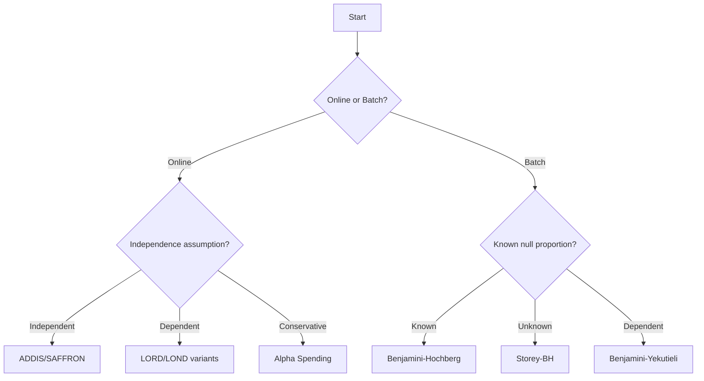

# User Guide

Welcome to the comprehensive **online-fdr** user guide. This section provides in-depth explanations of concepts, methods, and best practices for online false discovery rate control.

## Overview

Online FDR control is essential when hypotheses arrive sequentially and decisions must be made immediately. Unlike traditional batch methods that see all p-values beforehand, online methods adapt their decision thresholds based on previous results.

## Guide Structure

This user guide is organized into the following sections:

### [Concepts](concepts.md)
**Fundamental concepts and terminology**

- False Discovery Rate (FDR) vs Family-Wise Error Rate (FWER)
- Online vs Batch testing paradigms  
- Alpha spending and alpha investing principles
- Dependency structures and their implications

### [Sequential Testing](sequential.md)
**Methods that test one hypothesis at a time**

- Alpha Investing Family (GAI, SAFFRON, ADDIS)
- LORD Family (LORD3, LORD++, D-LORD, etc.)
- LOND methods for different dependency structures
- Alpha spending approaches

### [Batch Testing](batch.md)
**Methods that test multiple hypotheses simultaneously**

- Benjamini-Hochberg and adaptive variants
- Methods for dependent test statistics
- When to choose batch vs online approaches

### [Data Generation](data_generation.md)
**Simulation utilities for testing and validation**

- Built-in data generating processes
- Creating custom simulation scenarios
- Power analysis and method evaluation

### [Performance Evaluation](evaluation.md)
**Tools for assessing method performance**

- FDR and power calculations
- Metrics for online settings
- Benchmarking and comparison frameworks

### onlineFDR Parity
**Method-level parity and intentional differences**

- Mapping to Bioconductor `onlineFDR` release semantics
- Explicit `Parity` / `IntentionalDivergence` / `Extension` labels
- Notes on true-online API differences in this package

## Quick Navigation

=== "New to FDR Control?"
    Start with [Concepts](concepts.md) to understand the fundamentals, then move to [Sequential Testing](sequential.md) for practical applications.

=== "Experienced User?"
    Jump directly to [Sequential Testing](sequential.md) or [Batch Testing](batch.md) based on your needs.

=== "Researcher/Developer?"
    Focus on [Performance Evaluation](evaluation.md) and [Data Generation](data_generation.md) for simulation studies.

=== "Application-Specific?"
    Browse [Examples](../examples/index.md) for domain-specific use cases.

## Common Workflows

### 1. **Choosing the Right Method**



### 2. **Parameter Selection**

Most methods require careful parameter tuning:

- **Alpha level (alpha)**: Your desired FDR level (typically 0.05 or 0.1)
- **Initial wealth (W)**: Controls early power (start with `alpha/2`)  
- **Lambda (lambda)**: Candidate threshold for ADDIS/SAFFRON (try 0.25-0.5)
- **Tau (tau)**: Discarding threshold for ADDIS (try 0.5)

### 3. **Performance Monitoring**

Track key metrics during online testing:

```python
from online_fdr.utils.evaluation import MemoryDecayFDR

# Initialize tracking
fdr_tracker = MemoryDecayFDR(delta=0.99, offset=0)

# During testing
for p_value, true_label in data_stream:
    decision = method.test_one(p_value)
    current_fdr = fdr_tracker.score_one(decision, true_label)
    
    # Optional: Stop if FDR exceeds threshold
    if current_fdr > target_alpha * 1.2:  # 20% buffer
        print("Warning: FDR approaching target level")
```

## Best Practices

###  **Do's**
- Choose methods appropriate for your dependency structure
- Validate with simulations before real applications  
- Monitor FDR in real-time for early stopping
- Use consistent random seeds for reproducibility
- Document method parameters and their rationale

###  **Don'ts**  
- Don't switch methods mid-stream without theoretical justification
- Don't ignore dependency when present
- Don't use overly aggressive parameters without validation
- Don't forget to account for multiple testing in downstream analyses

## Integration Examples

### With Scikit-learn Pipelines

```python
from sklearn.pipeline import Pipeline
from sklearn.feature_selection import SelectKBest
from online_fdr.investing.addis.addis import Addis

class OnlineFDRSelector:
    def __init__(self, alpha=0.05):
        self.method = Addis(alpha=alpha, wealth=alpha/2, lambda_=0.25, tau=0.5)
    
    def fit_transform(self, X, y):
        # Apply statistical tests and online FDR control
        selected_features = []
        for i in range(X.shape[1]):
            p_value = statistical_test(X[:, i], y)  # Your test here
            if self.method.test_one(p_value):
                selected_features.append(i)
        return X[:, selected_features]
```

### With A/B Testing Frameworks

```python
class OnlineABTester:
    def __init__(self, alpha=0.05):
        self.method = Addis(alpha=alpha, wealth=alpha/2, lambda_=0.25, tau=0.5)
        
    def analyze_variant(self, control_data, variant_data):
        p_value = statistical_test(control_data, variant_data)
        decision = self.method.test_one(p_value)
        
        return {
            'significant': decision,
            'p_value': p_value,
            'current_alpha': getattr(self.method, 'alpha', None)
        }
```

## Advanced Topics

For specialized use cases, see:

- [Theory Section](../theory/index.md) for mathematical foundations
- [API Reference](../api/index.md) for complete method documentation  
- [Examples](../examples/index.md) for domain-specific applications
- [Contributing Guide](../contributing.md) for adding new methods

## Getting Help

If you're stuck or need clarification:

1. **Check the FAQ** in each section
2. **Browse existing [GitHub Issues](https://github.com/OliverHennhoefer/online-fdr/issues)**
3. **Start a [GitHub Discussion](https://github.com/OliverHennhoefer/online-fdr/discussions)**
4. **Consult the referenced papers** for theoretical details

Ready to dive deeper? Choose a section above or continue with [Concepts](concepts.md) for the theoretical foundations.


