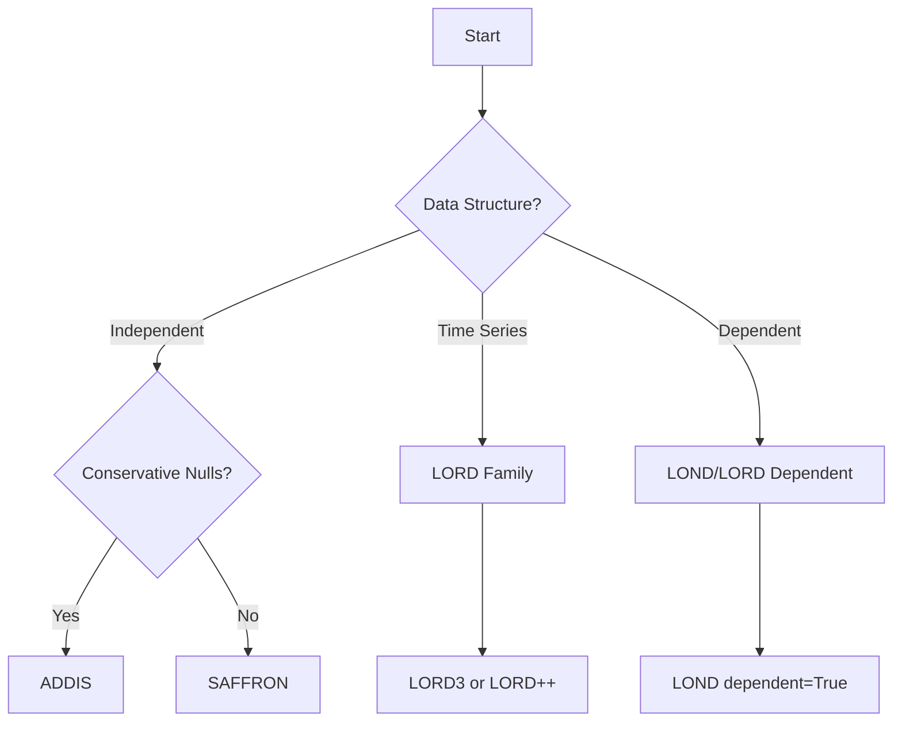

# Sequential Testing Methods

Sequential testing methods process hypotheses one at a time as they arrive, making immediate decisions without waiting for future p-values. This is essential for real-time applications like A/B testing, clinical trials, and streaming data analysis.

## Overview

Online FDR control methods fall into two main categories:

!!! info "Alpha Investing Methods"
    Start with initial "wealth" and adapt thresholds based on discoveries. More powerful but require parameter tuning.

!!! info "Alpha Spending Methods"  
    Pre-allocate significance budget across tests. Conservative but simpler to use.

## Alpha Investing Methods

### Core Principle

All alpha investing methods follow the **wealth dynamics** principle:

```python
# Conceptual wealth update
# Pseudocode (conceptual only)
if p_value <= current_threshold:
    wealth += reward  # Earn wealth from discovery
    discoveries += 1
else:
    wealth -= cost    # Optional: pay cost for testing
```

### Available Methods

#### ADDIS: Adaptive Discarding
**Best for**: General-purpose online FDR control with conservative nulls

```python
from online_fdr.investing.addis.addis import Addis

# Create ADDIS instance
addis = Addis(
    alpha=0.05,      # Target FDR level
    wealth=0.025,    # Initial wealth
    lambda_=0.25,    # Candidate threshold  
    tau=0.5          # Discarding threshold
)

# Test p-values sequentially
p_values = [0.001, 0.15, 0.03, 0.8, 0.02]
for i, p_val in enumerate(p_values):
    decision = addis.test_one(p_val)
    print(f"Test {i+1}: p={p_val:.3f}  {'REJECT' if decision else 'ACCEPT'}")
```

**Key features:**
- **Discarding**: Large p-values (> tau) are discarded without testing
- **Candidate selection**: Only p-values <= lambda become candidates for rejection
- **Conservative null adaptation**: Performs well when nulls are not uniform

#### SAFFRON: Serial Estimate of False Discovery Rate
**Best for**: High-throughput screening applications

```python
from online_fdr.investing.saffron.saffron import Saffron

# Create SAFFRON instance  
saffron = Saffron(
    alpha=0.05,      # Target FDR level
    wealth=0.025,    # Initial wealth
    lambda_=0.5      # Candidate threshold
)

# Test sequentially
discoveries = 0
for p_val in [0.01, 0.3, 0.02, 0.9, 0.001]:
    if saffron.test_one(p_val):
        discoveries += 1
        print(f"Discovery: p-value: {p_val:.3f}")

print(f"Total discoveries: {discoveries}")
```

**Key features:**
- **Adaptive null proportion estimation**: Estimates fraction of true nulls
- **Candidate-based**: Similar to ADDIS but without discarding
- **Proven FDR control**: Under independence assumptions

#### LORD Family: Levels based on Recent Discovery
**Best for**: Time series and temporally structured data

```python
from online_fdr.investing.lord.three import LordThree
from online_fdr.investing.lord.plus_plus import LordPlusPlus

# LORD3: Recent discovery weighting
lord3 = LordThree(
    alpha=0.05,      # Target FDR level  
    wealth=0.025,    # Initial wealth
    reward=0.025     # Reward per discovery
)

# LORD++: Enhanced version with better power
lord_pp = LordPlusPlus(
    alpha=0.05,
    wealth=0.025,
    reward=0.05
)

# Compare both methods
p_values = [0.02, 0.3, 0.01, 0.8, 0.005, 0.4]

print("LORD3 decisions:")
for p_val in p_values:
    decision = lord3.test_one(p_val)
    print(f"  p={p_val:.3f}  {'REJECT' if decision else 'ACCEPT'}")

print("\nLORD++ decisions:")
for p_val in p_values:
    decision = lord_pp.test_one(p_val)  
    print(f"  p={p_val:.3f}  {'REJECT' if decision else 'ACCEPT'}")
```

**Variants available:**
- **LORD3**: Basic version with recent discovery weighting
- **LORD++**: Improved version with higher power
- **LORD Dependent**: For arbitrarily dependent p-values
- **LORD Discard**: Includes discarding of large p-values
- **LORD Memory Decay**: For non-stationary time series

#### LOND: Levels based on Number of Discoveries
**Best for**: Independent or weakly dependent p-values

```python
from online_fdr.investing.lond.lond import Lond

# For independent p-values
lond_indep = Lond(alpha=0.05, dependent=False)

# For dependent p-values
lond_dep = Lond(alpha=0.05, dependent=True)

# Test both versions
p_values = [0.04, 0.6, 0.01, 0.9, 0.03]

print("LOND Independent:")
indep_discoveries = sum(lond_indep.test_one(p) for p in p_values)
print(f"Discoveries: {indep_discoveries}")

print("\nLOND Dependent:")  
dep_discoveries = sum(lond_dep.test_one(p) for p in p_values)
print(f"Discoveries: {dep_discoveries}")
```

#### Generalized Alpha Investing (GAI)
**Best for**: Educational purposes and simple scenarios

```python
from online_fdr.investing.alpha.alpha import Gai

# Create GAI instance
gai = Gai(alpha=0.05, wealth=0.025)

# Simple testing loop
total_wealth_spent = 0
for p_val in [0.02, 0.5, 0.01, 0.8]:
    initial_wealth = gai.wealth if hasattr(gai, 'wealth') else 0
    decision = gai.test_one(p_val)
    
    print(f"p={p_val:.3f}, decision={'REJECT' if decision else 'ACCEPT'}")
```

## Alpha Spending Methods

### Core Principle

Alpha spending methods pre-allocate the total significance budget across tests:

```python
# Conceptual spending approach
total_alpha = 0.05
alpha_per_test = total_alpha / expected_number_of_tests

for p_value in p_values:
    if p_value <= alpha_per_test:
        reject()
```

### Available Methods

#### Alpha Spending with Spending Functions
**Best for**: Conservative control when number of tests is known

```python
from online_fdr.spending.alpha_spending import AlphaSpending
from online_fdr.spending.functions.bonferroni import Bonferroni

# Bonferroni spending function
bonf_func = Bonferroni(k=100)  # Expecting 100 tests

# Create alpha spending instance
alpha_spend = AlphaSpending(
    alpha=0.05,
    spend_func=bonf_func
)

# Test sequentially  
p_values = [0.0001, 0.1, 0.0005, 0.3]
for i, p_val in enumerate(p_values):
    decision = alpha_spend.test_one(p_val)
    current_alpha = alpha_spend.alpha if alpha_spend.alpha else 0
    print(f"Test {i+1}: p={p_val:.4f}, alpha_t={current_alpha:.6f}, "
          f"decision={'REJECT' if decision else 'ACCEPT'}")
```

#### Online Fallback Procedure
**Best for**: Combining different strategies

```python
from online_fdr.spending.online_fallback import OnlineFallback

# Create online fallback instance
fallback = OnlineFallback(alpha=0.05)

# Test with fallback strategy
results = []
for p_val in [0.001, 0.3, 0.005, 0.7, 0.002]:
    decision = fallback.test_one(p_val)
    results.append(decision)
    
print(f"Fallback results: {results}")
print(f"Total discoveries: {sum(results)}")
```

## Method Selection Guide

### Decision Framework



### Performance Comparison

Based on simulation studies:

| Method | Power (Independent) | Power (Dependent) | Parameter Complexity | Robustness |
|--------|-------------------|------------------|---------------------|------------|
| ADDIS | Context-dependent | Context-dependent | Medium | High |
| SAFFRON | Context-dependent | Context-dependent | Low | Medium |
| LORD3 | Context-dependent | Context-dependent | Medium | High |
| LOND | Context-dependent | Context-dependent | Low | High |
| GAI | Context-dependent | Context-dependent | Low | Medium |

## Parameter Tuning Guidelines

### Universal Parameters

!!! tip "Alpha (alpha)"
    **Target FDR level**
    - Standard values: 0.05, 0.1
    - Higher values allow more discoveries but more false positives

!!! tip "Initial Wealth (W)"
    **Starting budget for rejections**
    - Conservative: alpha/4
    - Moderate: alpha/2
    - Aggressive: 3*alpha/4

### Method-Specific Parameters

=== "ADDIS"
    - **Lambda (`lambda_`)**: Lower = fewer candidates, higher bar for rejection
    - **Tau (`tau`)**: Higher = fewer discarded tests
    - **Typical values**: lambda in [0.1, 0.7], tau in [0.3, 0.8]

=== "LORD Family"
    - **reward**: Wealth gained per discovery
    - **Typical values**: 0.01 to 0.1
    - **Higher values**: More aggressive after discoveries

=== "SAFFRON"  
    - **Lambda (`lambda_`)**: Balance between candidates and threshold
    - **Typical values**: 0.25 to 0.75

## Common Patterns

### Pattern 1: Conservative Online Testing

```python
# Use when false positives are costly
from online_fdr.investing.addis.addis import Addis

conservative_addis = Addis(
    alpha=0.05,      # Strict FDR control
    wealth=0.01,     # Low initial wealth  
    lambda_=0.1,     # Few candidates
    tau=0.3          # Aggressive discarding
)
```

### Pattern 2: High-Throughput Screening

```python
# Use when processing many tests quickly
from online_fdr.investing.saffron.saffron import Saffron

screening_saffron = Saffron(
    alpha=0.1,       # Allow more discoveries
    wealth=0.05,     # Moderate wealth
    lambda_=0.5      # Balanced candidate selection
)
```

### Pattern 3: Time Series Analysis

```python
# Use when tests have temporal structure
from online_fdr.investing.lord.three import LordThree

timeseries_lord = LordThree(
    alpha=0.05,
    wealth=0.025,
    reward=0.025     # Reward for clustering discoveries
)
```

## Advanced Usage

### Monitoring Wealth Dynamics

```python
def track_wealth(method, p_values):
    """Track wealth changes during sequential testing."""
    
    wealth_history = []
    decisions = []
    
    for p_val in p_values:
        # Record wealth before testing
        current_wealth = getattr(method, 'wealth', 0)
        wealth_history.append(current_wealth)
        
        # Make decision
        decision = method.test_one(p_val)
        decisions.append(decision)
        
        if decision:
            print(f"Discovery at p={p_val:.4f}, wealth before: {current_wealth:.4f}")
    
    return wealth_history, decisions

# Example usage
from online_fdr.investing.addis.addis import Addis

addis = Addis(alpha=0.1, wealth=0.05, lambda_=0.5, tau=0.7)
p_vals = [0.01, 0.3, 0.02, 0.8, 0.005]

wealth_hist, decisions = track_wealth(addis, p_vals)
print(f"Final wealth: {getattr(addis, 'wealth', 0):.4f}")
```

### Early Stopping Conditions

```python
def test_with_early_stopping(method, p_value_generator, max_tests=1000, 
                           min_discoveries=10):
    """Stop testing early if sufficient discoveries made."""
    
    discoveries = 0
    
    for i in range(max_tests):
        p_value = next(p_value_generator)
        
        if method.test_one(p_value):
            discoveries += 1
            
        # Early stopping condition
        if discoveries >= min_discoveries:
            print(f"Early stopping at test {i+1} with {discoveries} discoveries")
            break
    
    return discoveries

# Example with generator
import random

def p_value_generator():
    while True:
        yield random.uniform(0, 1)

from online_fdr.investing.lord.three import LordThree

lord3 = LordThree(alpha=0.1, wealth=0.05, reward=0.05)
total_discoveries = test_with_early_stopping(lord3, p_value_generator(), 
                                           max_tests=200, min_discoveries=5)
print(f"Stopped with {total_discoveries} discoveries")
```

## References

1. **Tian, J., and A. Ramdas** (2019). "ADDIS: an adaptive discarding algorithm for online FDR control with conservative nulls." *NeurIPS*.

2. **Ramdas, A., et al.** (2018). "SAFFRON: an adaptive algorithm for online control of the false discovery rate." *ICML*.

3. **Javanmard, A., and A. Montanari** (2018). "Online Rules for Control of False Discovery Rate and False Discovery Exceedance." *Annals of Statistics*.

4. **Foster, D. P., and R. A. Stine** (2008). "Alpha-investing: a procedure for sequential control of expected false discovery proportion." *JRSSB*.

## Next Steps

- **Learn about [batch methods](batch.md)** for offline testing scenarios
- **Explore [examples](../examples/basic_usage.md)** for hands-on practice
- **Understand [theory](../theory/fdr_control.md)** for mathematical foundations
